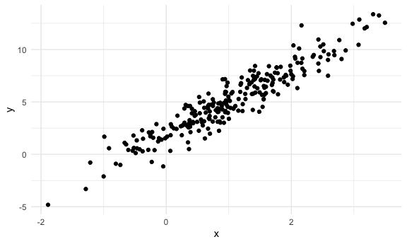
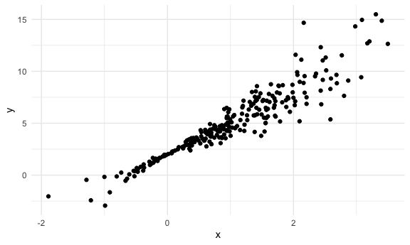
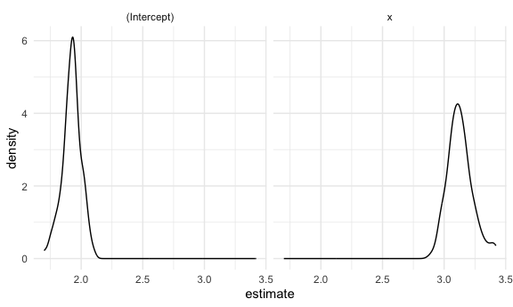
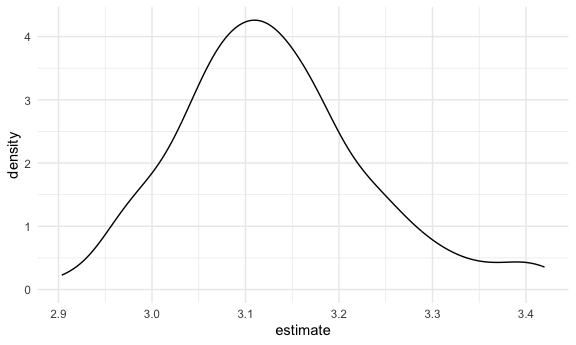
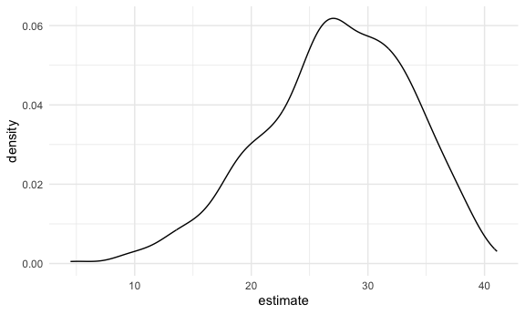

Bootstrapping
================

# Load packages

``` r
library(tidyverse)
```

    ## ── Attaching core tidyverse packages ──────────────────────── tidyverse 2.0.0 ──
    ## ✔ dplyr     1.1.3     ✔ readr     2.1.4
    ## ✔ forcats   1.0.0     ✔ stringr   1.5.0
    ## ✔ ggplot2   3.4.3     ✔ tibble    3.2.1
    ## ✔ lubridate 1.9.2     ✔ tidyr     1.3.0
    ## ✔ purrr     1.0.2     
    ## ── Conflicts ────────────────────────────────────────── tidyverse_conflicts() ──
    ## ✖ dplyr::filter() masks stats::filter()
    ## ✖ dplyr::lag()    masks stats::lag()
    ## ℹ Use the conflicted package (<http://conflicted.r-lib.org/>) to force all conflicts to become errors

``` r
library(p8105.datasets)
library(modelr)

set.seed(1)
```

setup

``` r
knitr::opts_chunk$set(
  fig.width = 6,
  fig.asp = .6,
  out.width = "90%"
)

theme_set(theme_minimal() + theme(legend.position = "right"))

options(
  ggplot2.continuous.colour = "viridis",
  ggplot2.continuous.fill = "viridis"
)

scale_colour_discrete = scale_colour_viridis_d
scale_fill_discrete = scale_fill_viridis_d
```

## Generate a relevant example

constant error variance then update to make version with nonconstant
error variance (errors are no longer normally distributed)

``` r
n_samp = 250

sim_df_const = 
  tibble(
    x = rnorm(n_samp, 1, 1),
    error = rnorm(n_samp, 0, 1),
    y = 2 + 3 * x + error
  )

sim_df_nonconst = 
  sim_df_const |> 
  mutate(error = error * .75 * x,
         y = 2+3 * x + error
         )

sim_df_const |> 
  ggplot(aes(x = x, y = y)) +
  geom_point()
```



``` r
sim_df_nonconst |> 
  ggplot(aes(x = x, y = y)) +
  geom_point()
```



fit some linear models

``` r
sim_df_const |> 
  lm(y ~ x, data = _) |> 
  broom::tidy()
```

    ## # A tibble: 2 × 5
    ##   term        estimate std.error statistic   p.value
    ##   <chr>          <dbl>     <dbl>     <dbl>     <dbl>
    ## 1 (Intercept)     1.98    0.0981      20.2 3.65e- 54
    ## 2 x               3.04    0.0699      43.5 3.84e-118

``` r
sim_df_nonconst |> 
  lm(y ~ x, data = _) |> 
  broom::tidy()
```

    ## # A tibble: 2 × 5
    ##   term        estimate std.error statistic   p.value
    ##   <chr>          <dbl>     <dbl>     <dbl>     <dbl>
    ## 1 (Intercept)     1.93    0.105       18.5 1.88e- 48
    ## 2 x               3.11    0.0747      41.7 5.76e-114

lm is encoding th assumptions of linear regression it’s assuming
constant sigma square across the domain but we know that is not the case
here bc we have nonconstant variance; so we have to do bootstrapping

## Draw and analyze a bootstrap sample

We can write a bootstrap function draw sample of this df of the exact
same size of the df; with replacement we previously defined sample as
250

``` r
boot_sample = function(df) {
  sample_frac(df, replace = TRUE)
}
```

Let’s see how this works

``` r
sim_df_nonconst |> 
  boot_sample() |> 
  ggplot(aes(x = x, y = y)) +
  geom_point(alpha = 0.5) +
  stat_smooth(method = "lm")
```

    ## `geom_smooth()` using formula = 'y ~ x'


diff in shading bc some points show up more than others; appear multiple
times keep running this and see diff samples with diff smooth lines

### Draw a lot of samples and analyze them

``` r
boot_straps = tibble(strap_number = 1:100) |> 
  mutate(
    strap_sample = map(strap_number, \(i) boot_sample(sim_df_nonconst))
  )

boot_straps |> 
  pull(strap_sample) |> 
  nth(1) |> 
  arrange(x)
```

    ## # A tibble: 250 × 3
    ##         x   error       y
    ##     <dbl>   <dbl>   <dbl>
    ##  1 -1.89   1.62   -2.04  
    ##  2 -1.89   1.62   -2.04  
    ##  3 -1.21  -0.781  -2.43  
    ##  4 -1.21  -0.781  -2.43  
    ##  5 -1.00   0.832  -0.169 
    ##  6 -0.989 -1.97   -2.93  
    ##  7 -0.914 -0.908  -1.65  
    ##  8 -0.606 -0.106   0.0774
    ##  9 -0.536  0.0227  0.413 
    ## 10 -0.524 -0.536  -0.106 
    ## # ℹ 240 more rows

^showing diff bootstrap samples every time

Now do the `lm` fit

``` r
boot_results = 
  boot_straps |> 
  mutate(
    models = map(strap_sample, \(df) lm(y~x, data = df)),
    results = map(models, broom::tidy)) |> 
  select(strap_number, results) |> 
  unnest(results)
```

try to summarize these results, get a bootstrap SE

``` r
boot_results |> 
  group_by(term) |> 
  summarize(
    se = sd(estimate)
  )
```

    ## # A tibble: 2 × 2
    ##   term            se
    ##   <chr>        <dbl>
    ## 1 (Intercept) 0.0752
    ## 2 x           0.102

we see less variability on intercept and more variaiblity on slope

look at the distribution

``` r
boot_results |> 
  ggplot(aes(x = estimate)) +
  geom_density() +
  facet_grid(. ~ term)
```



``` r
boot_results |>
  filter(term == "x") |> 
  ggplot(aes(x = estimate)) +
  geom_density()
```



Can I construct a CI

``` r
boot_results |> 
  group_by(term) |> 
  summarize(
    ci_lower = quantile(estimate, 0.025),
    ci_upper = quantile(estimate, 0.975)
  )
```

    ## # A tibble: 2 × 3
    ##   term        ci_lower ci_upper
    ##   <chr>          <dbl>    <dbl>
    ## 1 (Intercept)     1.76     2.06
    ## 2 x               2.97     3.38

## Airbnb example

``` r
data("nyc_airbnb")

nyc_airbnb = 
  nyc_airbnb |> 
  mutate(stars = review_scores_location / 2) |> 
  rename(
    borough = neighbourhood_group) |> 
  filter(borough != "Staten Island") |> 
  drop_na(price, stars) |> 
  select(price, stars, room_type, borough)
```

let’s fit a regression of `price` on other variables and lookt at
residuals

``` r
airbnb_fit <- nyc_airbnb |> 
  lm(price ~ stars + room_type + borough, data = _)
```

take a lookt at residuals

``` r
nyc_airbnb |> 
  modelr::add_residuals(airbnb_fit) |> 
  ggplot(aes(x = stars, y = resid)) +
  geom_point()
```


skewed distribution of residuals assumptions not valid so doing usual
regression will not work out well; does not follow our normal assumption

run a bootstrap on this whole thing to get estimates for the effect of
`stars` on `price`

``` r
manhattan_df = 
  nyc_airbnb |> 
  filter(borough == "Manhattan")

boot_results <-
  tibble(strap_number = 1:1000) |> 
  mutate(
    strap_sample = map(strap_number, \(i) boot_sample(manhattan_df)),
    models = map(strap_sample, \(df) lm(price~stars + room_type, data = df)),
    results = map(models, broom::tidy)
  ) |> 
  select(strap_number, results) |> 
  unnest(results)

boot_results |> 
  filter(term == "stars") |> 
  ggplot(aes(x = estimate)) +
  geom_density()
```


