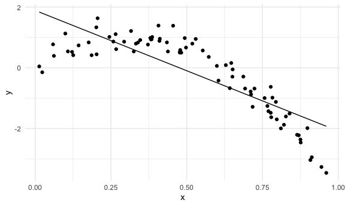
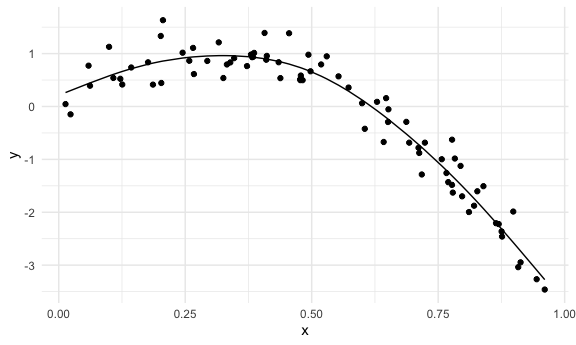
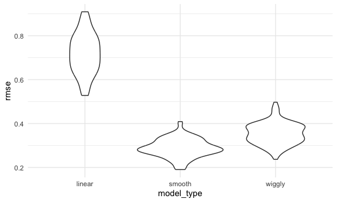

Cross Validation
================

# Load packages

``` r
library(tidyverse)
```

    ## ── Attaching core tidyverse packages ──────────────────────── tidyverse 2.0.0 ──
    ## ✔ dplyr     1.1.3     ✔ readr     2.1.4
    ## ✔ forcats   1.0.0     ✔ stringr   1.5.0
    ## ✔ ggplot2   3.4.3     ✔ tibble    3.2.1
    ## ✔ lubridate 1.9.2     ✔ tidyr     1.3.0
    ## ✔ purrr     1.0.2     
    ## ── Conflicts ────────────────────────────────────────── tidyverse_conflicts() ──
    ## ✖ dplyr::filter() masks stats::filter()
    ## ✖ dplyr::lag()    masks stats::lag()
    ## ℹ Use the conflicted package (<http://conflicted.r-lib.org/>) to force all conflicts to become errors

``` r
library(modelr)
library(mgcv)
```

    ## Loading required package: nlme
    ## 
    ## Attaching package: 'nlme'
    ## 
    ## The following object is masked from 'package:dplyr':
    ## 
    ##     collapse
    ## 
    ## This is mgcv 1.9-0. For overview type 'help("mgcv-package")'.

``` r
set.seed(1)
```

setup

``` r
knitr::opts_chunk$set(
  fig.width = 6,
  fig.asp = .6,
  out.width = "90%"
)

theme_set(theme_minimal() + theme(legend.position = "right"))

options(
  ggplot2.continuous.colour = "viridis",
  ggplot2.continuous.fill = "viridis"
)

scale_colour_discrete = scale_colour_viridis_d
scale_fill_discrete = scale_fill_viridis_d
```

Code for a qq plot

``` r
nyc_airbnb |> 
  modelr::add_residuals(fit) |> 
  ggplot(aes(sample=resid)) +
  stat_qq() +
  stat_qq_line()
```

# Nonlinear data and Cross Validation

runif - uniform distribution

``` r
nonlin_df = 
  tibble(
    id = 1:100,
    x = runif(100, 0, 1),
    y = 1 - 10 * (x - .3) ^ 2 + rnorm(100, 0, .3)
  )

nonlin_df |> 
  ggplot(aes(x = x, y = y)) + 
  geom_point()
```


# Do the train/test split

We will use an 80/20 split

``` r
train_df = sample_n(nonlin_df, 80)

test_df = anti_join(nonlin_df, train_df, by = "id")
```

``` r
train_df |> 
  ggplot(aes(x = x, y = y)) +
  geom_point() +
  geom_point(data = test_df, color = "red")
```


championes using smooth_mod for genralized additive models; use for most
nonlinear situations (like quadratic or cubic) k=30 means you’re getting
30 individual line segemetns; wiggly is just for educational purposes
here

``` r
linear_mod = lm(y ~ x, data = train_df)

smooth_mod = mgcv::gam(y ~ s(x), data = train_df)

wiggly_mod = mgcv::gam(y ~ s(x, k =30), sp = 10e-6, data = train_df)
```

quick visualization get fitted values with add predictions geompath or
geomliene draws line through your fitted values

``` r
train_df |> 
  modelr::add_predictions(linear_mod) |> 
  ggplot(aes(x = x, y = y)) +
  geom_point() +
  geom_line(aes(y = pred))
```



``` r
train_df |> 
  modelr::add_predictions(smooth_mod) |> 
  ggplot(aes(x = x, y = y)) +
  geom_point() +
  geom_line(aes(y = pred))
```



``` r
train_df |> 
  modelr::add_predictions(wiggly_mod) |> 
  ggplot(aes(x = x, y = y)) +
  geom_point() +
  geom_line(aes(y = pred))
```


Linear model is not a great model fit here looks like the smooth model
fits the best here for implementing an analysis

To assess overall goodness of fit, you look at rmse rmses on training
data can be misleading

``` r
rmse(linear_mod, train_df)
```

    ## [1] 0.7178747

``` r
rmse(smooth_mod, train_df)
```

    ## [1] 0.2874834

``` r
rmse(wiggly_mod, train_df)
```

    ## [1] 0.2498309

we’re looking for the lowest rmse to indicate the best fit seems like
wiggly works on this dataset but prob won’t on other datasets; so we’ll
look at our testing dataset

``` r
rmse(linear_mod, test_df)
```

    ## [1] 0.7052956

``` r
rmse(smooth_mod, test_df)
```

    ## [1] 0.2221774

``` r
rmse(wiggly_mod, test_df)
```

    ## [1] 0.289051

this shows that the smooth model likely works the best rmse on testing
data gives sense out prediction accuracy on out-of-sample data

# Now let’s try this process again using the cross validation function

cv takes the df and splits into training and testing split default uses
20% for test

``` r
cv_df = 
  nonlin_df |> 
  crossv_mc(n = 100) |> 
  mutate(
    train = map(train, as_tibble),
    test = map(test, as_tibble)
  )
```

just saving row numbers

have to turn back into a df

``` r
cv_df |>  pull(train) |>  nth(1) |> as_tibble()
```

    ## # A tibble: 79 × 3
    ##       id      x       y
    ##    <int>  <dbl>   <dbl>
    ##  1     1 0.266   1.11  
    ##  2     2 0.372   0.764 
    ##  3     3 0.573   0.358 
    ##  4     4 0.908  -3.04  
    ##  5     6 0.898  -1.99  
    ##  6     7 0.945  -3.27  
    ##  7     8 0.661  -0.615 
    ##  8     9 0.629   0.0878
    ##  9    10 0.0618  0.392 
    ## 10    11 0.206   1.63  
    ## # ℹ 69 more rows

we applied this again in the above code adding as tibble function

# Apply each model to all training datasets and evaluate on all testing datasets

let’s fit lm to all training datasets \#this code below only works bc
our dataframe already has a labelled x and y column

``` r
cv_results <- 
  cv_df |> 
  mutate(
    linear_fit = map(train, \(df) lm(y ~ x, data = df)),
    smooth_fit = map(train, \(df) mgcv::gam(y ~ s(x), data = df)),
    wiggly_fit = map(train, \(df) mgcv::gam(y ~ s(x, k = 30), sp = 10e-6, data = df))
  ) |> 
  mutate(
    rmse_linear = map2_dbl(linear_fit, test, \(mod, df) rmse (mod, df)),
    rmse_smooth = map2_dbl(smooth_fit, test, \(mod, df) rmse (mod, df)),
    rmse_wiggly = map2_dbl(wiggly_fit, test, \(mod, df) rmse (mod, df))
    )
```

use map2dbl bc our output is exactly one number so just show as such

# Aside

``` r
lin_mod_funct = function(df) {
  lm(y ~ x, data = df)
}
```

now let’s make our dataset tidy

``` r
cv_results |> 
  select(starts_with("rmse")) |> 
  pivot_longer(
    everything(),
    names_to = "model_type",
    values_to = "rmse",
    names_prefix = "rmse_"
  ) |> 
  group_by(model_type) |> 
  summarize(m_rmse = mean(rmse))
```

    ## # A tibble: 3 × 2
    ##   model_type m_rmse
    ##   <chr>       <dbl>
    ## 1 linear      0.718
    ## 2 smooth      0.289
    ## 3 wiggly      0.354

``` r
cv_results |> 
  select(starts_with("rmse")) |> 
  pivot_longer(
    everything(),
    names_to = "model_type",
    values_to = "rmse",
    names_prefix = "rmse_"
  ) |> 
  ggplot(aes(x = model_type, y = rmse)) +
  geom_violin()
```


